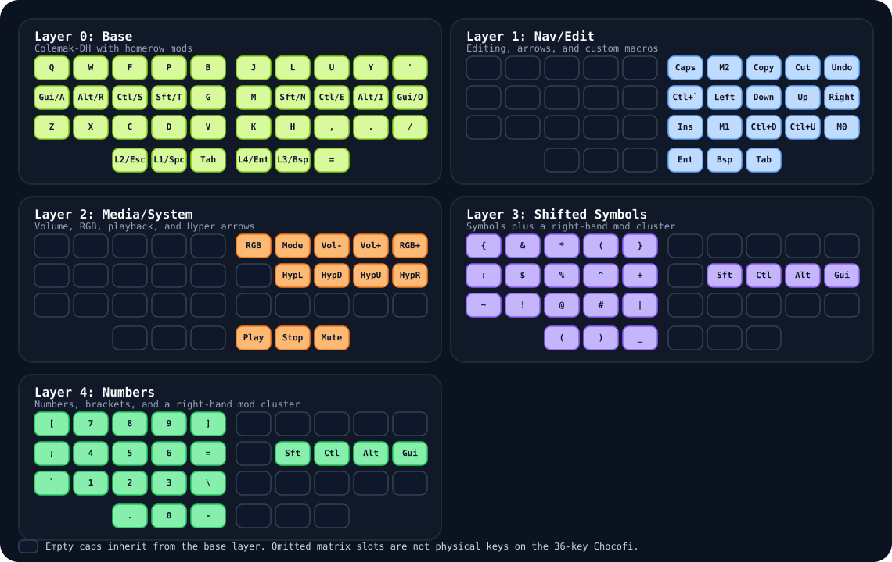

# Miryoku Layout for My 36-Key Chocofi

This repo captures the Miryoku-inspired layout I have settled on for the 36-key split Chocofi I use as my daily driver. It keeps the importable Vial save file alongside the QMK notes I want handy whenever I revisit the firmware.

## Setup At A Glance

- Board: 36-key split Chocofi
- Layout style: Miryoku-inspired
- Base layer: Colemak-DH
- Mods: homerow mods
- Firmware tooling: Vial / QMK
- QMK behavior tuning: `TAPPING_TERM 240`, `PERMISSIVE_HOLD`, `IGNORE_MOD_TAP_INTERRUPT`

## Repo Contents

- `exports/chocofi-miryoku-colemakdh.vil` contains the Chocofi-compatible Vial save file to import.
- `exports/miryoku-colemakdh.vil` preserves the earlier source layout save used for the conversion.
- `docs/layers-overview.svg` renders the active layers directly on GitHub.
- `docs/layout-notes.md` summarizes the base layer and the main layer roles.
- `docs/qmk-settings.md` documents the QMK behavior settings paired with this layout.

## Layer Diagram

Empty caps in the diagram inherit from the base layer. Omitted matrix slots are not physical keys on the 36-key Chocofi.

## Importing The Layout

1. Open Vial.
2. Back up your current layout.
3. Import `exports/chocofi-miryoku-colemakdh.vil`.
4. If you compile your own firmware, apply the QMK settings from `docs/qmk-settings.md`.

## Highlights

- Colemak-DH base layer with homerow mods on `A R S T` and `O I E N`
- Miryoku-style layer usage centered around thumb keys
- Navigation/edit, mouse, media/system, symbols, and numbers preserved in the save file
- The Vial snapshot keeps the custom macros already present in the settled layout
